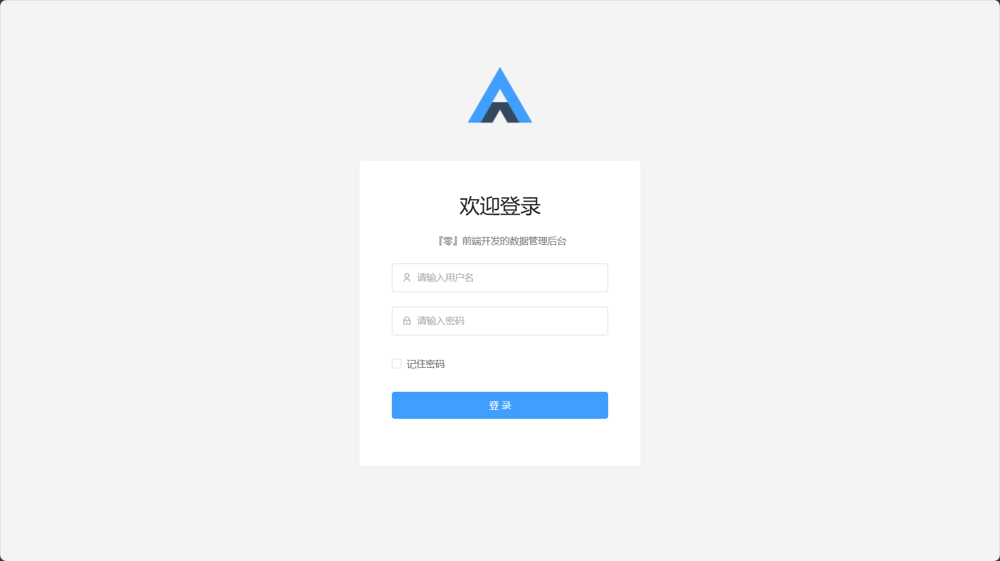
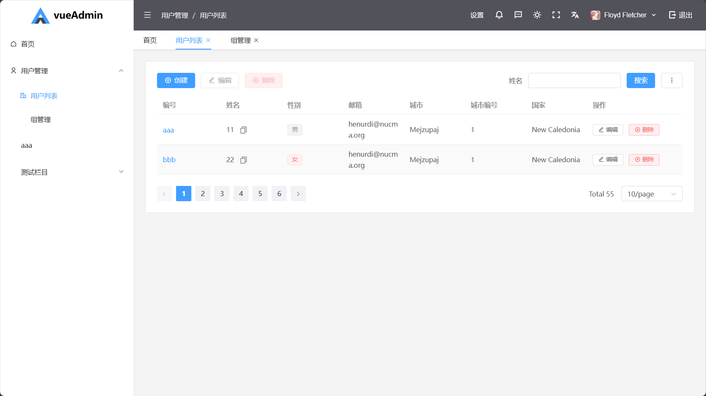

<!--
 * @Author: nmtuan nmtuan@qq.com
 * @Date: 2024-12-30 14:55:04
 * @LastEditors: nmtuan nmtuan@qq.com
 * @LastEditTime: 2024-12-30 14:59:56
 * @FilePath: \vueAdminDoc\en\intro.md
 * @Description: 
 * 
 * Copyright (c) 2024 by nmtuan@qq.com, All Rights Reserved. 
-->
# Project Introduction

vueAdmin is a data management solution for frontend and backend developers, aimed at simplifying the development process of data management pages. It is built on the technology stack of Vue3, Vite5, Pinia, Element Plus, and UnoCSS.

## Value Proposition

### For Frontend Developers

Eliminate repetitive, low-value data management page development, and focus on innovative and differentiated page design and implementation.

### For Backend Developers

Quickly build a fully functional data management backend without deep frontend knowledge, significantly reducing the technical learning curve.

## Related Links

* Online Demo
* [Project Documentation](https://vueAdmin.muyi.dev)
* [GitHub Repository]([NMTuan/vueAdmin](https://github.com/nmtuan/vueAdmin))

## Interface Preview

## Development Background

Data management platforms have become a standard feature of modern software products. Traditional data management methods often fall into repetitive labor: for each new feature, developers need to copy, paste, and modify existing table code, adjusting list items, query conditions, and other trivial details.

Two years ago, I developed the ezAdmin and ezAdmin3 projects, transforming tedious DOM operations into more elegant JSON configuration-driven processes. This innovation not only improved development efficiency but also avoided page rendering anomalies caused by unclosed tags.

However, my pursuit did not stop there. I wanted to further simplify the development process by allowing backend developers to handle JSON configuration work. After repeated exploration and optimization, vueAdmin was born.

Compared to its predecessor based on Nuxt3, vueAdmin is lighter, more flexible, and easier to integrate with backends in different languages. The core features of the project include:

* Arbitrary level column structure
* More elegant declaration logic
* More powerful functional extension capabilities

## Technical Architecture

`Vue3` `Vite5` `Pinia` `Element Plus` `UnoCSS` `Remix Icon`