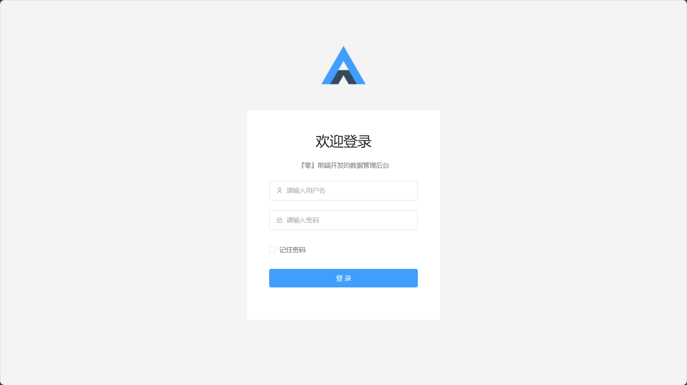
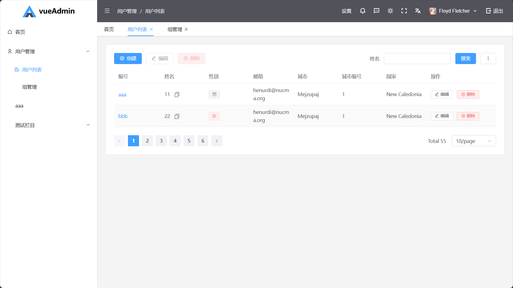

# 项目介绍

vueAdmin 是一个面向前端和后端开发者的中后台数据管理解决方案，旨在简化数据管理页面的开发流程。基于 Vue3、Vite5、Pinia、Element Plus 和 UnoCSS 技术栈构建。

## 价值主张

### 对前端开发者

摆脱重复、低价值的数据管理页面开发，将精力集中于创新性和差异化的页面设计与实现。

### 对后端开发者

无需深入前端技术，快速搭建功能完善的数据管理后台，大幅降低技术学习成本。

## 相关链接

* 在线演示
* [项目文档](https://vueAdmin.muyi.dev)
* [GitHub 源码]([NMTuan/vueAdmin](https://github.com/nmtuan/vueAdmin))

## 界面预览

## 开发背景

中后台数据管理平台已成为现代软件产品的标配。传统的数据管理方式往往陷入重复劳动：每增加一个功能，开发者都需要复制、粘贴、修改已有的表格代码，调整列表项、查询条件等琐碎细节。

早在两年前，我就开发了 ezAdmin 和 ezAdmin3 项目，将繁琐的 DOM 操作转变为更优雅的 JSON 配置驱动。这一创新不仅提高了开发效率，还避免了因标签未闭合导致的页面渲染异常。

然而，我的追求不止于此。我希望进一步简化开发流程，将 JSON 配置的工作交由后端开发者完成。经过反复探索和优化，vueAdmin 应运而生。

与基于 Nuxt3 的前身相比，vueAdmin 更加轻量、灵活，且易于与不同语言的后端集成。项目的核心特点包括：

* 任意层级的栏目结构
* 更优雅的声明逻辑
* 更强大的功能扩展能力

## 技术架构

`Vue3` `Vite5` `Pinia` `Element Plus` `UnoCSS` `Remix Icon`